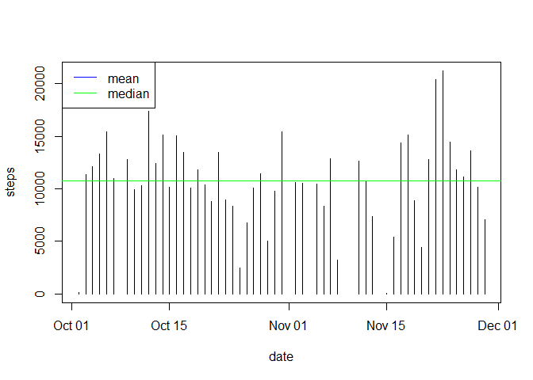

# Reproducible Research: Peer Assessment 1


## Loading and preprocessing the data

```r
dat <- read.csv("activity.csv")
dat$date <- as.Date(dat$date)
```


## What is mean total number of steps taken per day?

```r
totsteps <- aggregate(steps~date, dat, sum, na.rm=T)
meanspd <- mean(totsteps$steps)
mdnspd <- median(totsteps$steps)

plot(steps~date,totsteps,type="h")
abline(h=meanspd, col="blue")
abline(h=mdnspd, col="green")
legend("topleft",c("mean","median"), lwd=c(1,1),col=c("blue","green"))
```



```r
paste0("Mean:   ",meanspd)
```

```
## [1] "Mean:   10766.1886792453"
```

```r
paste0("Median: ",mdnspd)
```

```
## [1] "Median: 10765"
```

## What is the average daily activity pattern?

```r
avgsteps <- aggregate(steps~interval, dat, mean, na.rm=T)

plot(steps~interval,avgsteps,type="l")
```


```r
paste0("Maximum average steps at ",avgsteps$interval[which.max(avgsteps$steps)]," interval")
```

```
## [1] "Maximum average steps at 835 interval"
```


## Imputing missing values

```r
library(plyr)

paste0("Number of missing values is  ",sum(is.na(dat$steps)), " out of ", length(dat$steps), " data")
```

```
## [1] "Number of missing values is  2304 out of 17568 data"
```

```r
dat2 <- ddply(dat,~interval,transform,steps.imputedna=replace(steps,is.na(steps),mean(steps,na.rm=T)))

summary(dat2[,c(1,4)])
```

```
##      steps        steps.imputedna 
##  Min.   :  0.00   Min.   :  0.00  
##  1st Qu.:  0.00   1st Qu.:  0.00  
##  Median :  0.00   Median :  0.00  
##  Mean   : 37.38   Mean   : 37.38  
##  3rd Qu.: 12.00   3rd Qu.: 27.00  
##  Max.   :806.00   Max.   :806.00  
##  NA's   :2304
```

```r
totsteps2 <- aggregate(steps~date, dat2, sum, na.rm=T)
meanspd2 <- mean(totsteps2$steps)
mdnspd2 <- median(totsteps2$steps)

plot(steps~date,totsteps2,type="h")
abline(h=meanspd, col="blue")
abline(h=mdnspd, col="green")
legend("topleft",c("mean","median"), lwd=c(1,1),col=c("blue","green"))
```


```r
paste0("New Mean:   ",meanspd2)
```

```
## [1] "New Mean:   10766.1886792453"
```

```r
paste0("New Median: ",mdnspd2)
```

```
## [1] "New Median: 10765"
```


## Are there differences in activity patterns between weekdays and weekends?

```r
dat2$weekend <- factor(ifelse(weekdays(dat2$date, abbr=T)=="Sun" | weekdays(dat2$date, abbr=T)=="Sat","weekend","weekday"))

avgsteps2 <- aggregate(steps~interval+weekend, dat2, mean, na.rm=T)

xyplot(steps~interval|weekend,avgsteps2,type="l",layout=c(1,2))
```


